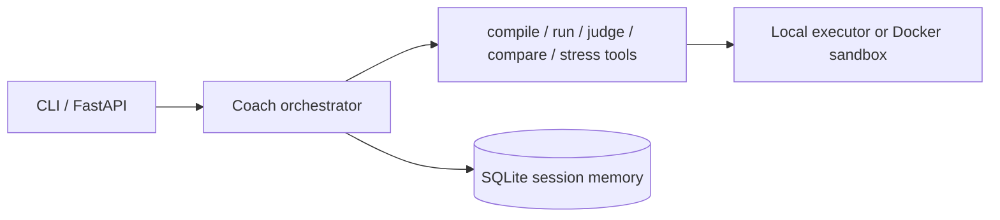

# ACM Agent — AI Competitive Programming Coach

ACM Agent is a tool-using competitive-programming coach. It invokes the real C++20
compiler and executable, so claims about compilation, output, WA, TLE or RE are always
backed by an observed process result. It also includes a differential/stress tester,
SQLite sessions, a CLI and an optional FastAPI endpoint. The original TinyLang visualizer
in this repository remains available below.

## Architecture



## Features and installation

```bash
uv sync
uv run acm-agent
```

Set `OPENAI_API_KEY`, `OPENAI_BASE_URL`, and `OPENAI_MODEL` in a local `.env` when wiring
an OpenAI Agents SDK provider. No key is needed for the deterministic tool layer or tests.

The CLI accepts normal messages and `/paste`, terminated by `/end`. Tools can also be
used directly:

```python
from acm_agent.tools import compare_cpp, stress_cpp
compare_cpp(candidate_code, reference_code, ["3\n-2 -5 -1\n"])
stress_cpp(candidate_code, reference_code, generator_code, iterations=1000, start_seed=1)
```

`compare_cpp` returns the first normalized-output mismatch. `stress_cpp` returns the seed
and complete generated input, making every counterexample reproducible. Passing finite
tests or random tests is not a proof of correctness.

## Web API

```bash
uv run uvicorn acm_agent.api.app:app --reload
```

Open `http://127.0.0.1:8000/` for the responsive chat interface. It keeps the current
session id in browser storage, accepts large multiline problem statements and C++ source,
and exposes structured tool results alongside the coach response. Interactive OpenAPI
documentation remains available at `http://127.0.0.1:8000/docs`.

`GET /health` is a liveness check; `POST /chat` accepts `{"message": "...", "session_id": null}`
and returns `answer`, `session_id`, and a structured `tool_result` when a tool ran.

## Security

The default subprocess executor is explicitly for **trusted code only**. For untrusted
submissions deploy the provided Docker abstraction with network disabled, read-only
filesystem, memory/CPU/process limits, dropped capabilities and `no-new-privileges`.
Container isolation still needs host hardening and operational monitoring.

## Tests and CI

```bash
uv run pytest
uv run ruff check .
```

GitHub Actions runs `uv sync`, Ruff and pytest without an API key. Runtime build artifacts
are written outside the repository (or `workspace/`) and `.env` is ignored.

## Roadmap

Connect a hosted Agents SDK model, add richer generator synthesis, persistent Docker worker
pooling, and streaming tool traces in the browser UI.
